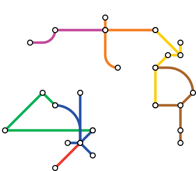

# MetroKit Python MVP

A personal project to build aesthetically pleasing graph structures with a Metro graphic design theme.

This version (the Python MVP) uses `svgwrite` to render the graph; however, I'm planning to port this to Swift using either AppKit or a SwiftUI canvas. I might also port this to React.js, but we'll see.

## Most Recent Graph Rendering

Only part of the graph is displayed on GitHub, not sure why. Download the svg if you want to view the whole thing!

